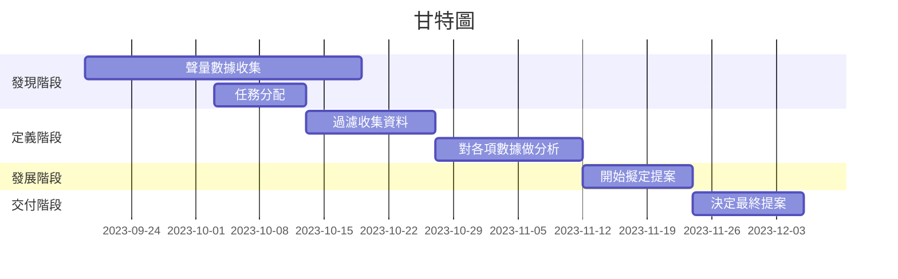

## 甘特圖

```mermaid
gantt
    title 甘特圖

    section 發現階段
    聲量數據收集:a1,2023-09-19, 30d
    任務分配:a2,2023-10-03,10d
    section 定義階段
    過濾收集資料:a3,after a2, 14d
    對各項數據做分析:a4,after a3, 16d
    section 發展階段
    開始擬定提案:a5,after a4,12d
    section 交付階段
    決定最終提案:a6,after a5,12d
    
```
